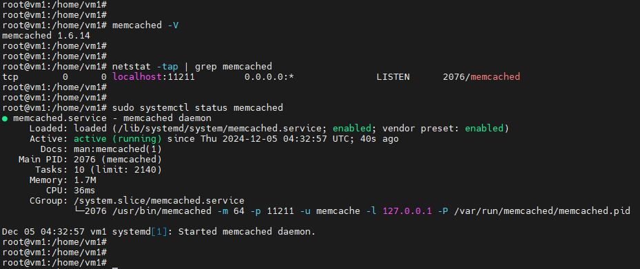
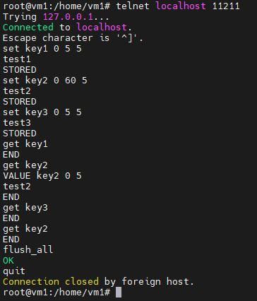
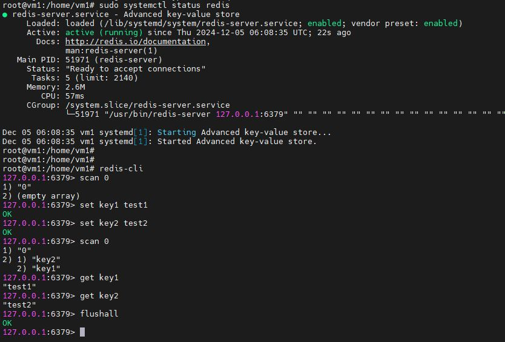

Домашнее задание к занятию "Кеширование Redis/memcached" - <Бычков Денис Вячеславович>

Задание 1. Кеширование
Приведите примеры проблем, которые может решить кеширование.

Кеширование — это мощный механизм, который позволяет улучшить производительность приложений и систем, снижая время доступа к часто используемым данным.

1. Снижение времени отклика: При обращении к базе данных или внешнему API может возникать задержка, вызванная временем обработки запроса. Кеширование наиболее запрашиваемых данных позволяет значительно ускорить доступ к ним, так как информация извлекается из кеша, который работает быстрее, чем обращение к основным данным.
2. Уменьшение нагрузки на серверы: При высокой нагрузке на серверы кеширование может помочь снизить количество запросов к базе данных. Это снижает нагрузку на сервер и повышает его устойчивость, что особенно важно для веб-приложений с высокой посещаемостью.
3. Оптимизация использования сети: При использовании внешних API или удаленных ресурсов кеширование помогает избежать избыточного трафика. Например, если информация о погоде запрашивается на каждом пользовательском запросе, кеширование данных может сократить количество обращений к стороннему сервису, тем самым экономя пропускную способность и снижая затраты.
4. Облегчение распределенной архитектуры: В микросервисах или распределенных системах кеширование помогает уменьшить время доступа к часто используемым данным, поскольку различные сервисы могут извлекать данные из кеша, а не взаимодействовать друг с другом или с основной базой данных. Это увеличивает скорость работы всей системы.

Таким образом, кеширование является важным инструментом для решения широкого круга проблем, связанных с производительностью и эффективностью работы систем и приложений.

Задание 2. Memcached
Установите и запустите memcached.

sudo apt update && sudo apt install memcached
memcached -V
sudo netstat -tap | grep memcached
sudo systemctl status memcached

Задание 3. Удаление по TTL в Memcached
Запишите в memcached несколько ключей с любыми именами и значениями, для которых выставлен TTL 5.

Записал key2 TTL 60, при первом выводе, значение test2 ещё оставался в памяти, но когда прошла минута, при вводе get key2, значение стало пустым
set key1 0 5 5
test1
STORED
set key2 0 60 5
test2
STORED
set key3 0 5 5
test3
STORED
get key1
END
get key2
VALUE key2 0 5
test2
END
get key3
END
get key2
END
flush_all
OK
quit

Задание 4. Запись данных в Redis
Запишите в Redis несколько ключей с любыми именами и значениями.

Через redis-cli достаньте все записанные ключи и значения из базы, приведите скриншот этой операции.

